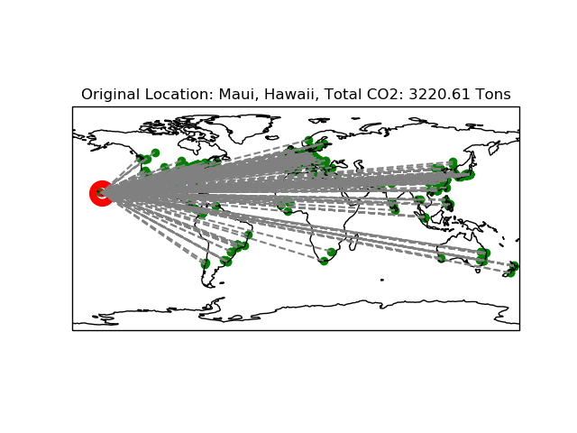
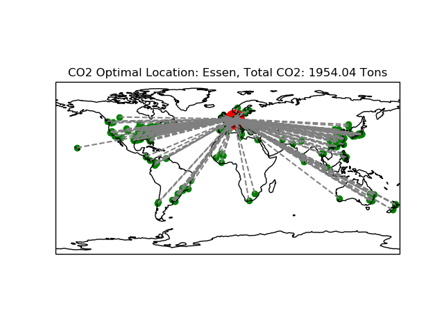

# Calculating CO2 Emissions of Scientific Conferences

Where does it make sense to host scientific conferences?
From a Co2 perspective, where everyone arrives by plane, certainly not in Hawai:

### Original Location (3221 t CO2):

### Best Location using naive algorithm (1954 t CO2):
Savings: 1267 t Co2.

# Method
- Scanning the conference proceedings for the origins of the authors. First author is used to determine origin.

- Then a routing of a direct flight is done between the conference venue and the origins of all authors. 

- Sum of C02-Emissions of all flights is calculated.

- Method is repeated setting major big cities as the conferences virtual venue. 

- Best result wins and indicates the most CO2-efficient venue.

# Discussion
Of course, we simplify the problem massively.
- locals and near bys who arrive by train or other green means of transport are neglected.
- Direct flights are assumed
- Emissions at the venue (energy, water, ...) are neglected
